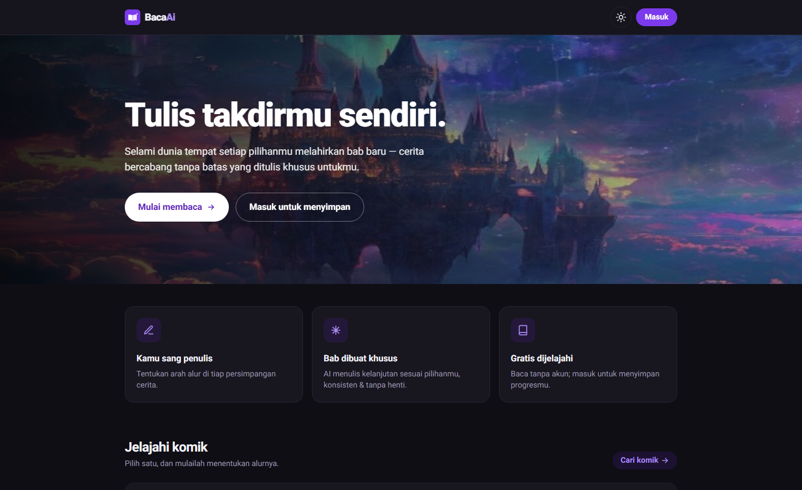

# BacaAi

### Komik interaktif fantasi anime & manhwa — **pilihanmu yang menulis ceritanya.** ✨

Baca kisah bercabang di mana setiap keputusanmu melahirkan bab baru, ditulis khusus oleh AI.
Bukan sekadar membaca — **siapa pun bisa menerbitkan komiknya sendiri.**

 

  

 

> 🎨 **Proyek showcase / portofolio.** Dibuat untuk memamerkan ide & rekayasa —
> bukan produk untuk penggunaan umum. Tidak ada panduan instalasi publik di sini.

---

## 🎬 Idenya

Seorang penulis hanya menulis **satu bab pembuka**. Dari sana, AI mengambil alih:

1. Ketika sebuah bab belum punya pilihan, AI menyusun dua arah alur.
2. Pembaca memilih — atau **menulis arahnya sendiri** — lalu AI menulis bab berikutnya.
3. Setiap cabang di-*generate* sekali lalu **di-cache**, jadi pohon cerita tumbuh
   seiring pembaca menjelajah. Tak ada dua pembaca yang membaca kisah yang sama.

---

## ✨ Sorotan fitur

|  |  |
| --- | --- |
| 📖 **Cerita bercabang** | Setiap keputusan memunculkan bab baru bikinan AI, di-cache untuk pembaca berikutnya. |
| ✍️ **Tulis arahmu sendiri** | Tak cocok dengan opsi? Ketik sendiri ke mana kisah melaju. |
| 🎭 **Semua orang penulis** | Bukan cuma admin — user biasa pun bisa membuat & menerbitkan komiknya. |
| 🤖 **Rekomendasi AI** | Satu klik menyusun **judul + sinopsis + Bab 1 + sampul** bernuansa manhwa/anime. |
| 🖼️ **Sampul bergaya anime** | Gambar di-*generate* on-topic dari adegan bab — ilustrasi, bukan foto stok. |
| 🧭 **Lini masa pilihan** | Riwayat tiap cerita jadi timeline per-bab yang bisa dibuka-tutup. |
| 🔐 **Login mulus** | Email/password tanpa verifikasi + **Login dengan Google**. |
| 🛠️ **Dashboard admin** | Sidebar rapi: ringkasan, tambah komik, kelola komik & pengguna. |
| 🌙 **Dark mode & responsif** | Bersih dari layar kecil hingga desktop, lengkap dengan pencarian & paginasi. |

---

## 🧠 Sorotan rekayasa

Detail-detail kecil yang bikin pengalamannya terasa mulus:

- **Konteks AI berbatas** — model hanya melihat *bab pembuka + N bab terakhir*
  (`AI_CONTEXT_CHAPTERS`), plus instruksi anti-pengulangan tokoh, supaya cerita
  konsisten tanpa prompt yang membengkak.
- **Prosa hidup** — AI diminta menyertakan dialog & sedikit emoji; renderer
  memberi *drop cap*, blok dialog bergaya, dan ornamen pergantian adegan.
- **Gambar on-topic** — frasa adegan Bahasa Inggris → ilustrasi anime yang
  di-*generate* deterministik (URL ber-seed), tanpa API key.
- **Auth tanpa friksi** — pendaftaran lewat admin API (`email_confirm`) sehingga
  **tak ada email verifikasi** & tak kena rate-limit; Google OAuth dengan
  pemilih akun.
- **Data aman** — Supabase Postgres + **RLS**, service-role hanya di server,
  Server Actions untuk semua mutasi.
- **Sentuhan UI** — montase hero sinematik, sidebar admin ber-*scroll-spy*,
  timeline riwayat yang bisa diciutkan, hero & CTA full-bleed.

---

## 🧱 Dibangun dengan

- **Next.js 16** (App Router · Server Components · Server Actions · `proxy.ts`)
- **React 19** · **TypeScript** · **Tailwind CSS v4** · font **Roboto**
- **Supabase** — Auth (email + Google) & Postgres dengan RLS
- **AI teks** — LLM kompatibel-OpenAI (**NVIDIA Nemotron**) · `lib/ai.ts`
- **AI gambar** — generator **Pollinations** (keyless) · `lib/images.ts`
- **Vitest** untuk unit test logika inti

---

## 🗂️ Peta singkat

| Lapisan | Lokasi |
| --- | --- |
| Halaman & UI | `app/` (Server Components) + `components/` |
| Server Actions | `app/actions/` (`auth` · `reading` · `stories` · `admin`) |
| Generasi cerita | `lib/ai.ts` → chat kompatibel-OpenAI |
| Generasi gambar | `lib/images.ts` → ilustrasi anime |
| Mesin baca | `lib/reading.ts` (resolve/generate + cache bab) |
| Skema DB | `schema.sql` (+ `supabase/*.sql`) |

---

Sebuah proyek showcase — dibuat dengan ❤️ untuk pencinta cerita bercabang.

